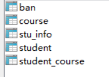
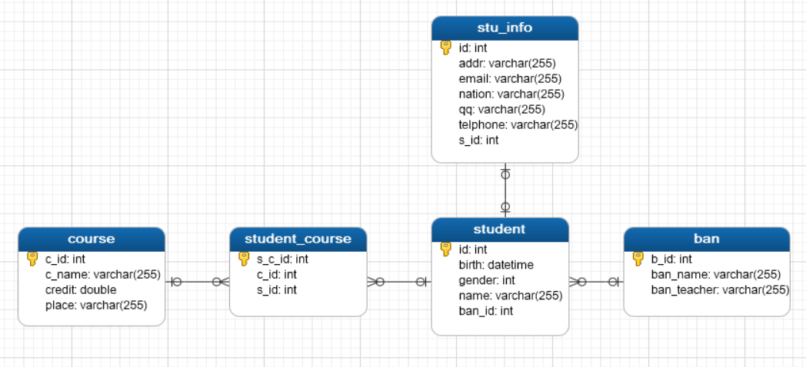

# springdata

## 1.Spring Data:  Spring 的一个子项目。用于简化数据库访问，支持**NoSQL**和**关系数据库存储**。其主要目标是使数据库的访问变得方便快捷。 

Spring Data 项目所支持NoSQL存储：

      - - MongoDB（文档数据库）

      - - Neo4j （图形数据库）

      - - Redis（键/值存储）

      - - Hbase（列族数据库）

Spring Data 项目所支持的关系数据存储技术：

       - - JDBC

       - - **JPA**
## 2.JPA Spring Data:  致力于减少数据访问层（DAO）的开发量。开发者唯一要做的，就只是声明持久层的接口，其他都交给Spring Data JPA 来帮你完成！ 

## 3.jpa+springdata实例开发

### 1.数据库表



表与表的关系：



### 2.建立springboot项目，添加jpa组件

引入的pom：

```pom
<dependency>
    <groupId>org.springframework.boot</groupId>
    <artifactId>spring-boot-starter-data-jpa</artifactId>
</dependency>
```

### 3.配置数据源

```yaml
spring:
  datasource:
    username: root
    password: xxxxxx
    url: jdbc:mysql://localhost:3306/myschool?useUnicode=true&characterEncoding=UTF-8
    driver-class-name: com.mysql.jdbc.Driver
    type: com.alibaba.druid.pool.DruidDataSource
    #配置数据源
    initialSize: 5
    minIdle: 5
    maxActive: 20
    maxWait: 60000
    timeBetweenEvictionRunsMillis: 60000
    minEvictableIdleTimeMillis: 300000
    validationQuery: SELECT 1 FROM DUAL
    testWhileIdle: true
    testOnBorrow: false
    testOnReturn: false
    poolPreparedStatements: true
    #   配置监控统计拦截的filters，去掉后监控界面sql无法统计，'wall'用于防火墙
    filters: stat,wall,log4j
    maxPoolPreparedStatementPerConnectionSize: 20
    useGlobalDataSourceStat: true
    connectionProperties: druid.stat.mergeSql=true;druid.stat.slowSqlMillis=500
  jpa:
    hibernate:
    #自动更新表，没有表就自动创建
      ddl-auto: update
    #控制台显示sql
    show-sql: true
server:
  port: 9090
  context-path: /leeray
```

### 4.创建实体类

student实体

```java
@Data
@Entity
@Table
public class Student {
    @Id//主键标识
    @GeneratedValue(strategy = GenerationType.IDENTITY)//设置主键自增，如果不是自增可以不写
    private Integer id;
    private Integer gender;
    private String name;
    private Date birth;
    @Transient//告诉spring不要为banId做属性到字段的映射
    private Integer banId;
```

ban实体

```java
@Data
@Entity
@Table
public class Ban {
    @Id
    @GeneratedValue(strategy = GenerationType.IDENTITY)
    private Integer bId;
    private String banName;
    private String banTeacher;
```

stuInfo实体

```java
@Data
@Entity
@Table
public class StuInfo {
    @Id
    @GeneratedValue(strategy = GenerationType.IDENTITY)//主键自增
    private Integer id;
    private String addr;//地址
    private String nation;//名族
    private String telphone;//电话号码
    private String qq;//qq号
    private String email;//电子邮箱
    @Transient
    private Integer sId;
```

course实体

```java
@Data
@Entity
@Table
public class Course {
    @Id
//    @GeneratedValue(strategy = GenerationType.IDENTITY)//设置主键自增，不要自增了,改用uuid
    private Integer cId;//课程ID
    private String cName;//课程名称
    private String place;//上课地点
    private Double credit;//学分
```

student_course实体

```java
@Data
@Entity
@Table
public class Student_Course {
    @Id
    @GeneratedValue(strategy = GenerationType.IDENTITY)
    private Integer s_cId;
    private Integer sId;
    private Integer cId;
```

@Data是一个注解，它可以自动帮你生成get/set,构造等方法。

要使用它需要在pom中引入依赖

```pom
<dependency>
    <groupId>org.projectlombok</groupId>
    <artifactId>lombok</artifactId>
    <scope>provided</scope>
</dependency>
```

### 4.在实体类中配置对应关系

#### 1.一对一关系

在数据库中，学生和学生信息一个一对一关系。student保存基本信息，stuInfo保存详细信息。配置对应关系要确定谁是维护方，谁是被维护方。这里我选择stuInfo为维护方。

在StuInfo类中：

```java
    //配置一对一关系
    //一个学生只能有一个详细信息表
    @OneToOne(fetch = FetchType.LAZY)//懒加载
    @JoinColumn(name = "sId",unique = true)//查询结果集为单个
    private Student student;
```

@OneToOne注解用于表示一对一的表关系

fetch = FetchType.LAZY代表懒加载（默认也是懒加载）

name表示要映射的字段，这里就是stuInfo中的外键sId了。

unique = true表示查询结果集为单个。因为一个学生只能有一个详细信息

此时只是配置了stuInfo对student的一对一关系，我们仅可以从查到的stuInfo对象中查到student。

而不能从查到的student对象中查到stuInfo信息。所以还要在student类中配置：

```java
 //一对一关系
    @OneToOne(mappedBy = "student")
    private StuInfo stuInfo;
```

由于student是被维护方，所以写法比较简单。mappedBy所映射的就是stuInfo类中的private Student student;

