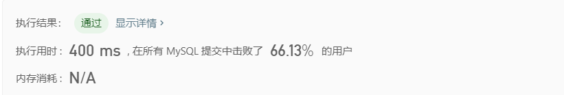

# sql练习

## 1，第二高的薪水

### 1.数据表


### 2.问题

编写一个 SQL 查询，获取 `Employee` 表中第二高的薪水（Salary） 。 

### 3.预期结果


### 4.编写sql

```sql
# Write your MySQL query statement below
select max(salary) as SecondHighestSalary from employee where
salary < (select max(salary) from employee)
```

### 提交结果


## 2，大的国家

### 1.数据表


### 2.问题

如果一个国家的面积超过300万平方公里，或者人口超过2500万，那么这个国家就是大国家。

编写一个SQL查询，输出表中所有大国家的名称、人口和面积。

### 3.编写sql

```sql
select name,population,area from World
where area > 3000000 or population > 25000000
```

### 4.结果


## 3超过5门课的学生

### 1.数据表


### 2.问题

有一个`courses` 表 ，有: **student (学生)** 和 **class (课程)**。

请列出所有超过或等于5名学生的课。表数据可能有重复。

### 3.编写sql

```sql
select class from courses
group by class
having count(distinct student) >= 5
```

目标是查询课程，条件是该课程有超过或等于5名学生选。

先对class分组，再去重。最后判断。

##4.上升的温度

### 1.数据表


### 2.问题

给定一个 `Weather` 表，编写一个 SQL 查询，来查找与之前（昨天的）日期相比温度更高的所有日期的 Id。 

### 3.编写sql

```sql
select a.id as Id from Weather a, Weather b
where a.Temperature>b.Temperature and datediff(a.RecordDate,b.RecordDate)=1
```

### 4.结果


## 5.第N高的薪水

### 1.问题及数据表


### 2.SQL

```sql
CREATE FUNCTION getNthHighestSalary(N INT) RETURNS INT
BEGIN
    SET N = N - 1;//必须在gegin中设置N值
  RETURN (
      # Write your MySQL query statement below.
      select DISTINCT salary //工资不能重复
      from Employee 
      order by salary desc //按照工资从高到低排序
      limit N,1//选择第N位数据
  );
END
```

### 3.结果



## 6.查找重复的邮箱

### 1.问题及数据表


### 2.编写aql

```sql
SELECT Email 
FROM person
GROUP BY email//根据相同的邮箱分组
Having count(*) > 1;//只选择组成员数目大于1的组，即邮箱重复的组
```

### 3.运行结果


## 7.从不订购的客户

### 1.问题


### 2.编写sql

```sql
SELECT  Name AS Customers  
from Customers c LEFT JOIN Orders o
on c.id = o.CustomerId where CustomerId is null;
```

### 3.运行结果


